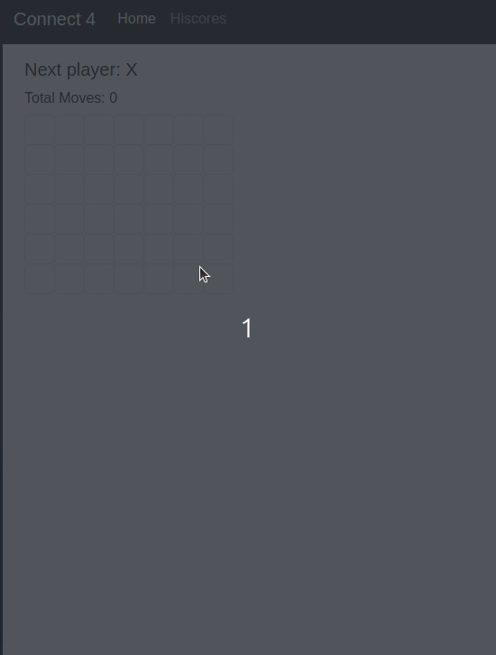

# Hi there, my name is Karl Albornoz. Nice to meet you!

## Programmer for [Layton City](https://laytoncity.org) by Day
## Computer Science student at [Weber State University](https://weber.edu) by Night.

### Here's some stuff that I've worked on/done
-----------------------------------------------

#### Connect 4

[https://github.com/Kalbornoz/Connect4](https://github.com/Kalbornoz/Connect4)

<!--
**Kalbornoz/Kalbornoz** is a ✨ _special_ ✨ repository because its `README.md` (this file) appears on your GitHub profile.

Here are some ideas to get you started:

- 🔭 I’m currently working on ...
- 🌱 I’m currently learning ...
- 👯 I’m looking to collaborate on ...
- 🤔 I’m looking for help with ...
- 💬 Ask me about ...
- 📫 How to reach me: ...
- 😄 Pronouns: ...
- ⚡ Fun fact: ...
-->
