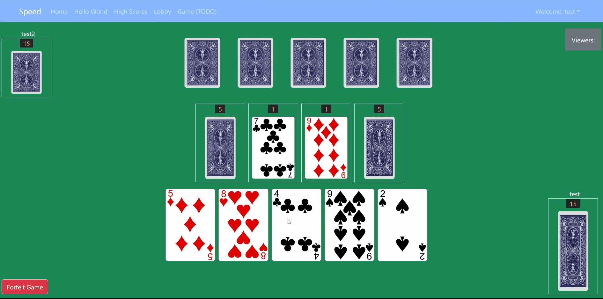
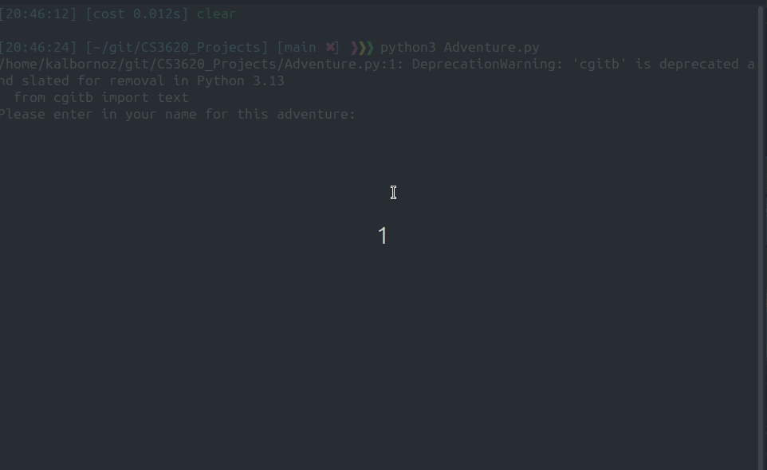
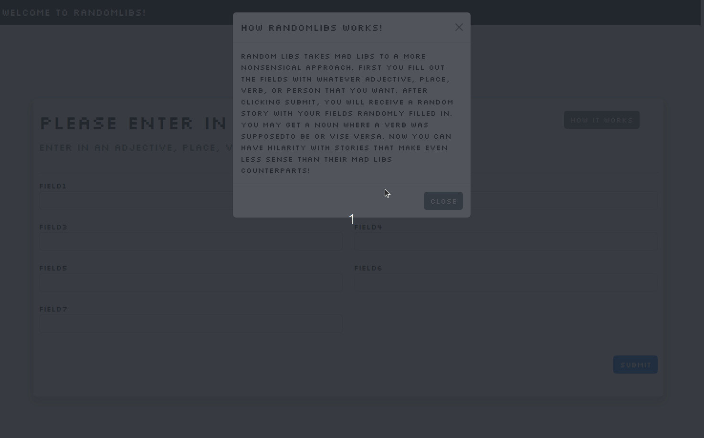
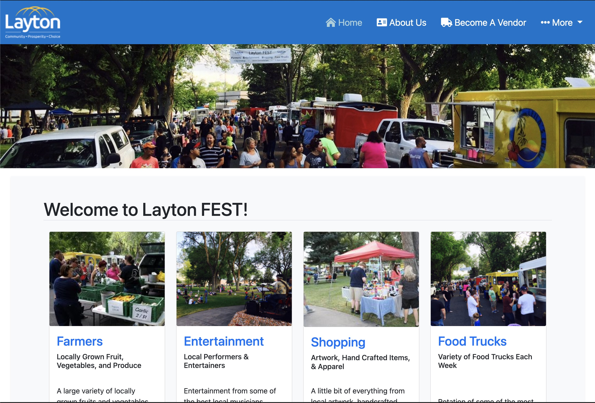

# Hi there, my name is Karl Albornoz. Nice to meet you!

## Programmer for [Layton City](https://laytoncity.org) by Day
## Computer Science student at [Weber State University](https://weber.edu) by Night.

## Here's some stuff that I've worked on/done

## MERN Projects
-----------------------------------------------
### Speed Game

[https://github.com/JS-WSU/speed-game5](https://github.com/JS-WSU/speed-game5)

### Connect 4

[https://github.com/Kalbornoz/Connect4](https://github.com/Kalbornoz/Connect4)

## Django/Python Projects
-----------------------------------------------
### Choose your own Adventure

[https://github.com/Kalbornoz/CS3620_Projects](https://github.com/Kalbornoz/CS3620_Projects)

### Random Libs made with Django

[https://github.com/Kalbornoz/django_madlibs](https://github.com/Kalbornoz/django_madlibs)

## Blazor
-----------------------------------------------

### Layton FEST site
[https://www.laytoncity.org/laytonfest](https://www.laytoncity.org/laytonfest)

## Description

This was a project that I made for work at Layton City. This was my first big experience working with Microsofts new framework Blazor, which is an extension of their .NETCore framework. It is mainly a static site that serves as a flyer for Layton City's FEST activity which takes place on fridays during the summer. I made it using Blazor Server Side as opposed to Blazor Web Assembly (or client side).

<!--
**Kalbornoz/Kalbornoz** is a ✨ _special_ ✨ repository because its `README.md` (this file) appears on your GitHub profile.

Here are some ideas to get you started:

- 🔭 I’m currently working on ...
- 🌱 I’m currently learning ...
- 👯 I’m looking to collaborate on ...
- 🤔 I’m looking for help with ...
- 💬 Ask me about ...
- 📫 How to reach me: ...
- 😄 Pronouns: ...
- ⚡ Fun fact: ...
-->
